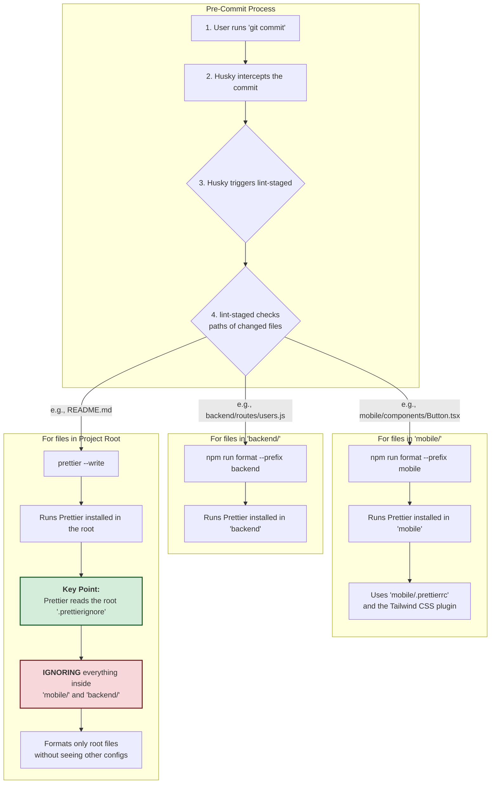

# X-Clone Project

This is a monorepo for the X-Clone application, containing the mobile client and the backend server.

## Getting Started

To get started with the project, clone the repository and install the dependencies for each workspace.

### Project Structure: Monorepo and Workspaces

This project is a monorepo that contains two primary workspaces:

- `backend/`: The Node.js server application.
- `mobile/`: The React Native mobile application.

Each workspace has its own `package.json` file with its own dependencies and scripts. The root `package.json` contains development dependencies and scripts that are relevant to the entire project (like `husky` and `lint-staged`).

**Running Scripts in a Workspace**

To run a script defined in a workspace's `package.json` from the project root, you must use the `-w` (or `--workspace`) flag.

For example, to run the `test` script defined in `mobile/package.json`, you would run the following command from the root directory:

```bash
npm run test -w mobile
```

### Mobile

```bash
# To install dependencies for all workspaces, just run this in the root:
npm install
```

### Backend

```bash
# Dependencies for all workspaces are installed via a single `npm install` in the root.
```

## Code Formatting

This project uses [Prettier](https://prettier.io/) for consistent code formatting. The configuration is located in the root `.prettierrc` file.

To ensure that your code is formatted correctly, please follow these steps:

1.  **Install the Prettier extension/plugin for your code editor.**
    - [Prettier for VS Code](https://marketplace.visualstudio.com/items?itemName=esbenp.prettier-vscode)
    - For other editors like WebStorm, Vim, etc., please refer to the [official Prettier documentation](https://prettier.io/docs/en/editors.html).

2.  **Enable "Format on Save".**
    - **For VS Code:** We have included a recommended `.vscode/settings.json` file. To use it, simply remove `.vscode/` from the root `.gitignore` file. Alternatively, you can configure it manually in your own editor settings. The file should look like this:

    ```json
    {
      "editor.formatOnSave": true,
      "editor.defaultFormatter": "esbenp.prettier-vscode"
    }
    ```

    - **For other editors:** Please consult your editor's documentation on how to enable format on save.

By following these steps, you will ensure that all code contributed to the project maintains a consistent style.

### Automated Formatting on Commit

This project uses [Husky](https://typicode.github.io/husky/) and [lint-staged](https://github.com/okonet/lint-staged) to automatically format your code each time you make a commit.

- **How it works:** Before a commit is finalized, `lint-staged` runs Prettier on all the files you've changed. This ensures that no un-formatted code ever makes it into the repository.
- **Setup:** This is enabled automatically! After you run `npm install` in the project root, the `prepare` script sets up the Git hooks for you.
- **Bypassing (for emergencies only):** If you ever need to make a commit without running the pre-commit checks, you can use the `--no-verify` flag: `git commit -m "My message" --no-verify`. This should be used sparingly.

### How Pre-Commit Formatting Works

This monorepo uses a sophisticated `lint-staged` setup to ensure that each workspace (`mobile`, `backend`) and the project root are formatted independently using their own specific configurations. This prevents conflicts and keeps dependencies isolated.

Here's a breakdown of the process that happens when you run `git commit`:



#### Key Takeaway

The crucial part of this setup is the root `.prettierignore` file. By explicitly ignoring the `mobile/`
